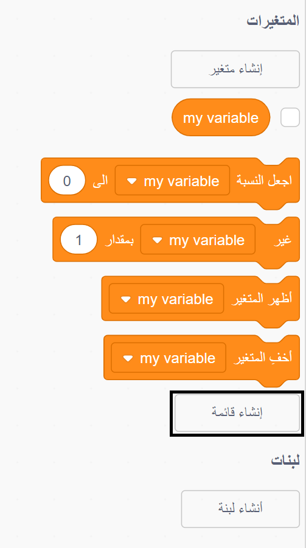
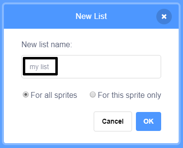
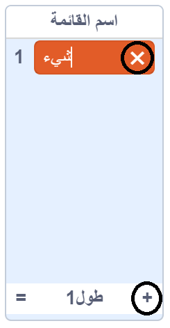

+ انقر فوق **إنشاء قائمة** أسفل **المتغيرات**.

+ قم بكتابة اسم قائمة. يمكنك اختيار ما إذا كنت تريد هذه القائمة أن تكون متاحة لجميع الكائنات، أو فقط لهذا المتغير. انقر فوق **موافق**.

+ بمجرد إنشاء اللائحة، ستظهر على المنصة، أو يمكنك إلغاء تحديد اللائحة من علامة تبويب المقاطع البرمجية لإخفائه.

+ اضغط على `+` في أسفل اللائحة لإضافة عناصر أو كائنات، و اضغط على الإكس بجانب المتغير لحذفة.

+ تعليمات برمجية جديدة ستظهر لك وستمكنك من إستخدام اللائحة في مشروعك.

