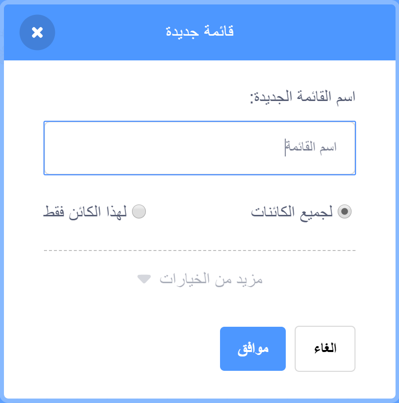

## إنشاء لائحة

+ Click on **Make a List** under **Variables**.

+ Type in the name of your list. You can choose whether you would like your list to be available to all sprites, or to only a specific sprite. Click **OK**.

+ بمجرد إنشاء اللائحة، ستظهر على المنصة، أو يمكنك إلغاء تحديد اللائحة من علامة تبويب المقاطع البرمجية لإخفائه.

+ اضغط على `+` في أسفل اللائحة لإضافة عناصر أو كائنات، و اضغط على الإكس بجانب المتغير لحذفة.

+ تعليمات برمجية جديدة ستظهر لك وستمكنك من إستخدام اللائحة في مشروعك.

