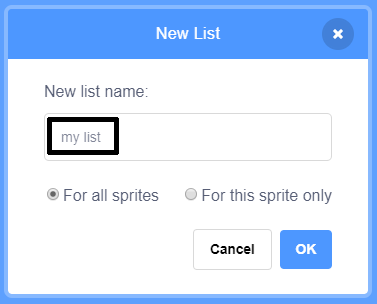
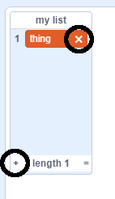

+ **Make a List** under **Variables**. ক্লিক করুন.

+ আপনার তালিকার নাম লিখুন।. আপনি আপনার তালিকাটি সমস্ত sprites এর কাছে উপলব্ধ রাখতে চান বা কেবল একটি নির্দিষ্ট sprite এর জন্য সেটি চয়ন করতে পারেন।. ক্লিক করুন **OK**.

+ একবার আপনি তালিকাটি তৈরি করার পরে এটি মঞ্চে প্রদর্শিত হবে, বা Scripts ট্যাবে আপনি তালিকাটি আন্ টিক্ করে লুকাতে পারেন.

+ আইটেম যোগ করতে তালিকার নীচে এটিতে `+` ক্লিক করুন এবং এটি মুছতে আইটেমের পাশের ক্রসটি ক্লিক করুন।.

+ নতুন ব্লকগুলি উপস্থিত হবে এবং আপনাকে আপনার প্রকল্পে আপনার নতুন তালিকা ব্যবহার করার অনুমতি দেবে.

