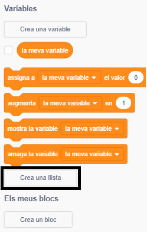
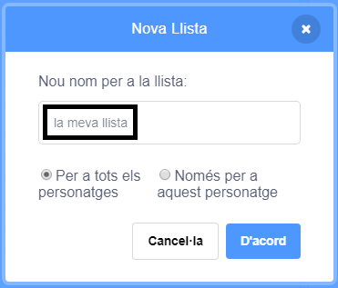
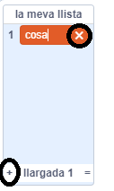
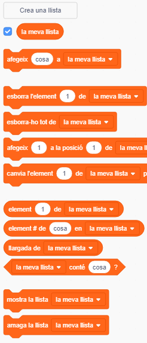

+ Fes clic a **Crea una llista** a l'apartat **Variables**.

+ Escriu-hi el nom de la teva llista. Pots triar si vols que la teva llista estigui disponible per a tots els personatges o només per a un d'específic. Fes clic a **D'acord**.

+ Una vegada que hagis creat la llista, aquesta es mostrarà en l'escenari, es pot amagar si desmarques la seva casella.

+ Fes clic a `+` en la part inferior de la llista per afegir elements i clica a la creu que està al costat d'un element per eliminar-lo.

+ Apareixeran nous blocs i us permetran utilitzar la nova llista del vostre projecte.

