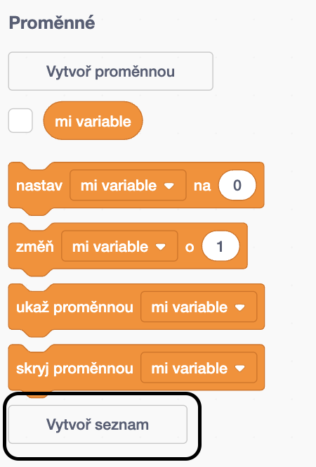
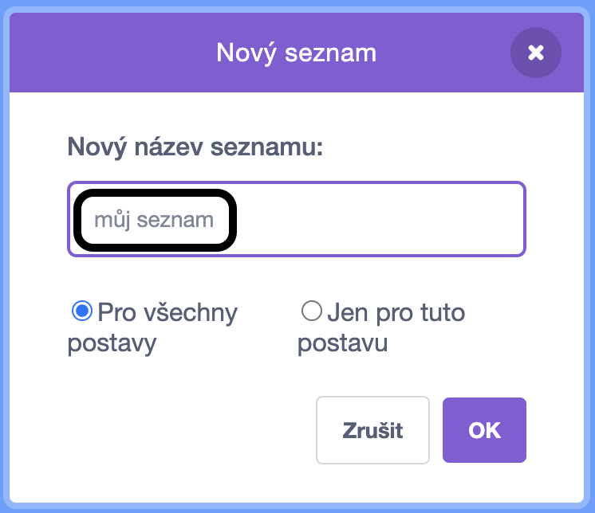
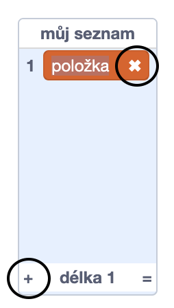
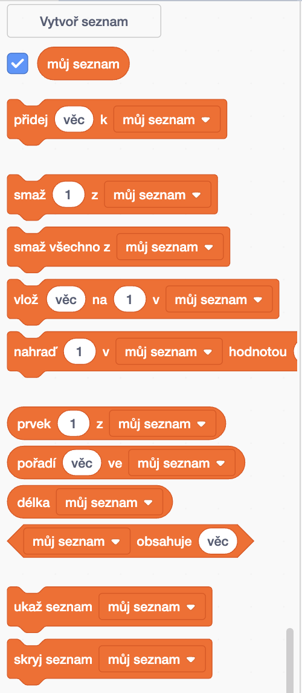

+ Klikněte na **Vytvořte seznam** pod **proměnnými**.

+ Zadejte název seznamu. Můžete si vybrat, zda chcete, aby byl váš seznam dostupný všem skřítkům nebo pouze určitému sprite. Klepněte na **OK**.

+ Jakmile seznam vytvoříte, zobrazí se na jevišti, nebo můžete zrušit seznam na kartě Skripty, aby se skryl.

+ Klepnutím na tlačítko `+` ve spodní části seznamu přidáte položky a kliknutím na křížku vedle položky jej odstraníte.

+ Zobrazí se nové bloky a umožní vám nový projekt použít ve svém projektu.

