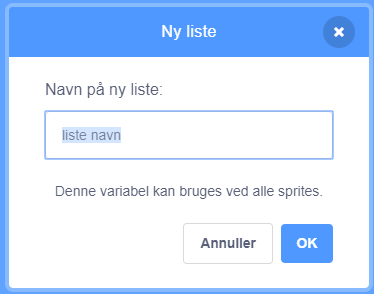
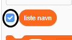
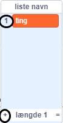

+ Click on **Make a List** under **Variables**.

+ Skriv navnet på din liste. Du kan vælge, om du vil have din liste tilgængelig for alle sprites eller kun en bestemt sprite. Click **OK**.

+ Når du har oprettet listen, vises den på scenen, eller du kan afmarkere listen på fanen Scripts igen for at skjule den.

+ Klik på `+` nederst på listen for at tilføje elementer og klik på krydset ved siden af ​​et element for at slette det.

+ Nye blokke vises og giver dig mulighed for at bruge din nye liste i dit projekt.

