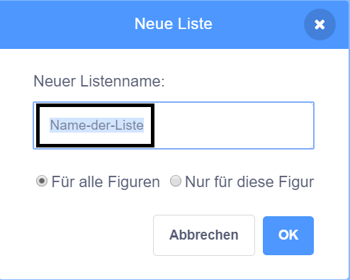

+ Klicke unter **Variablen** auf **Neue Liste**.

+ Tippe den Namen deiner Liste ein. Du kannst wählen, ob deine Liste für alle Figuren oder nur für eine bestimmte Figur verfügbar sein soll. Klicke auf **OK**.

+ Nachdem du die Liste erstellt hast, wird sie auf der Bühne angezeigt, oder sie wird versteckt, wenn du das Häkchen vor der Liste in der Registerkarte Code entfernst.

+ Klicke unten in der Liste auf das `+` um ein Element hinzuzufügen und klicke auf das X neben einem Element, um es zu löschen.

+ Neue Blöcke werden angezeigt, und mit ihnen kannst du deine neue Liste in deinem Projekt verwenden.

