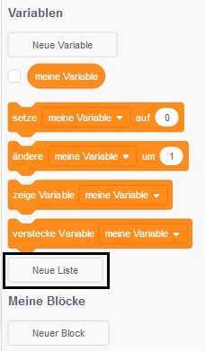

## Mache eine Liste

+ Click on **Make a List** under **Variables**.

+ Type in the name of your list. You can choose whether you would like your list to be available to all sprites, or to only a specific sprite. Click **OK**.

+ Nachdem du die Liste erstellt hast, wird sie auf der Bühne angezeigt, oder sie wird versteckt, wenn du das Häkchen vor der Liste in der Registerkarte Skripte entfernst.

+ Klicke unten in der Liste auf das `+` um ein Element hinzuzufügen und klicke auf das X neben einem Element, um es zu löschen.

+ Neue Blöcke werden angezeigt, und mit ihnen kannst du deine neue Liste in deinem Projekt verwenden.

