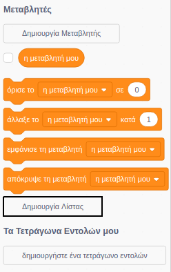
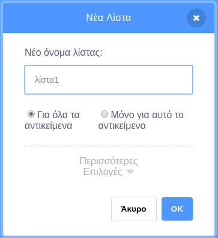
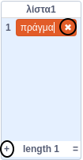
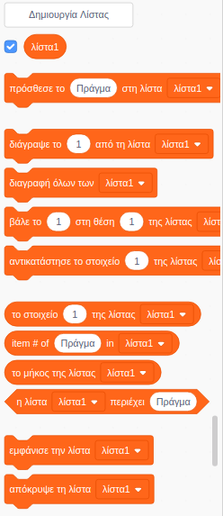

## Κάνε μία λίστα

+ Click on **Make a List** under **Variables**.

+ Type in the name of your list. You can choose whether you would like your list to be available to all sprites, or to only a specific sprite. Click **OK**.

+ Αφού δημιουργήσεις τη λίστα, αυτή θα εμφανιστεί στο σκηνικό. Μπορείς αν θες να την αποκρύψεις αποεπιλέγοντας τη λίστα στην καρτέλα Σενάρια.

+ Κάνε κλικ στο `+` στο κάτω μέρος της λίστας για να προσθέσεις στοιχεία. Κάνε κλικ στο Χ δίπλα σε ένα στοιχείο για να το διαγράψεις.

+ Θα εμφανιστούν νέα μπλοκ επιτρέποντας να χρησιμοποιήσεις τη νέα λίστα στο έργο σου.

