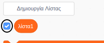

+ Κάνε κλικ στο **Δημιουργία Λίστας** στην ομάδα μπλοκ **Μεταβλητές**.

+ Πληκτρολόγησε το όνομα της λίστας σου. Μπορείς να επιλέξεις αν θέλεις να είναι διαθέσιμη η λίστα σου σε όλα τα αντικείμενα (sprites) ή μόνο σε αυτό το αντικείμενο. Πάτησε **ΟΚ**.

+ Αφού δημιουργήσεις τη λίστα, αυτή θα εμφανιστεί στο σκηνικό. Μπορείς αν θες να την αποκρύψεις αποεπιλέγοντας τη λίστα στην καρτέλα Σενάρια.

+ Κάνε κλικ στο `+` στο κάτω μέρος της λίστας για να προσθέσεις στοιχεία. Κάνε κλικ στο Χ δίπλα σε ένα στοιχείο για να το διαγράψεις.

+ Θα εμφανιστούν νέα μπλοκ επιτρέποντας να χρησιμοποιήσεις τη νέα λίστα στο έργο σου.

