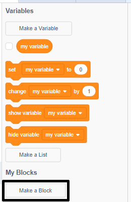
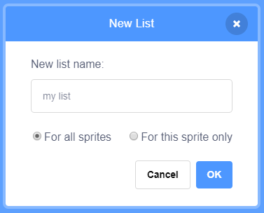

## Make a list

+ Click on **Make a List** under **Variables**.

+ Type in the name of your list. You can choose whether you would like your list to be available to all sprites, or to only a specific sprite. Click **OK**.

+ Once you have created the list, it will be displayed on the stage, or you can untick the list in the Scripts tab to hide it.

+ Click the `+` at the bottom of the list to add items, and click the cross next to an item to delete it.

+ New blocks will appear and allow you to use your new list in your project.

