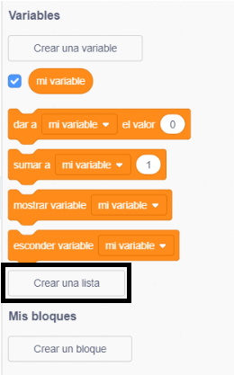
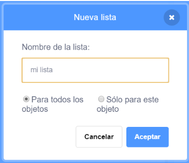
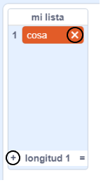
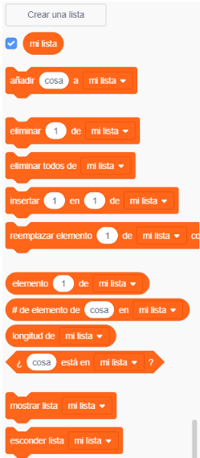

## Crear una lista

+ Click on **Make a List** under **Variables**.

+ Type in the name of your list. You can choose whether you would like your list to be available to all sprites, or to only a specific sprite. Click **OK**.

+ Una vez que hayas creado la lista, esta se mostrará en el escenario, pero puedes ocultarla desmarcándola en la pestaña Programas.

+ Para añadir elementos, haz clic en el signo `+` que está en la parte inferior de la lista, y haz clic en la X que hay al lado de un elemento para eliminarlo.

+ Aparecerán nuevos bloques que te dejarán usar tu nueva lista en tu proyecto.

