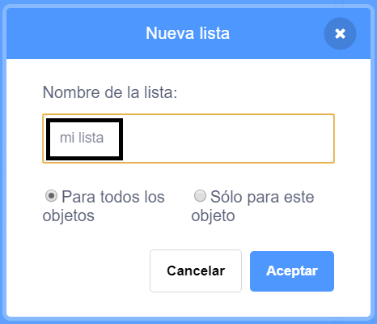

+ Haz clic en **Crear una lista** en la categoría **Variables**.

+ Escribe el nombre de tu lista. Puedes elegir si quieres que tu lista esté disponible para todos los sprites o solo para un sprite específico. Haz clic en **OK**.

+ Una vez que hayas creado la lista, esta se mostrará en el escenario, pero puedes ocultarla desmarcándola en la pestaña Programas.

+ Para añadir elementos, haz clic en el signo `+` que está en la parte inferior de la lista, y haz clic en la X que hay al lado de un elemento para eliminarlo.

+ Aparecerán nuevos bloques que te dejarán usar tu nueva lista en tu proyecto.

