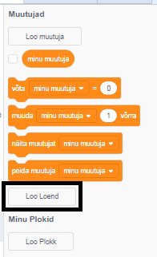
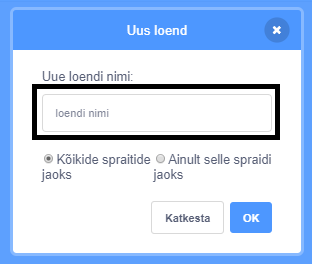
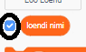
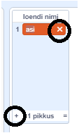
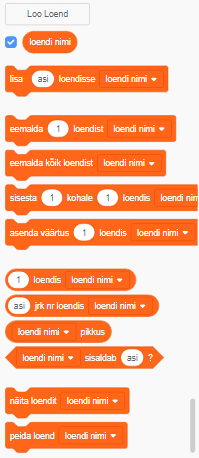

+ Klõpsa **Loo loend** **Muutujate** all.

+ Sisesta oma loendi nimi. Saad valida, kas soovid, et su loend oleks kõigile spraitidele või ainult konkreetsele spraidile kättesaadav. Klõpsa **OK**.

+ Kui oled muutuja loonud, kuvatakse see Laval, aga saad selle peitmiseks vahekaardil Skriptid muutuja eest linnukese ära võtta.

+ Elementide lisamiseks klõpsa loendi allosas olevale `+` ja selle kustutamiseks klõpsake elemendi kõrval olevale ristile.

+ Ilmuvad uued plokid ja nii saad kasutada oma uut loendit oma projektis.

