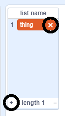

+ بر روی **Make a List** زیر **Variables** کلیک کنید.

+ نام لیست خود را وارد کنید. شما می‌توانید انتخاب کنید که آیا می‌خواهید لیست شما برای تمام شبح‌ها موجود باشد یا فقط برای یک شبح خاص در دسترس باشد. روی ** OK** کلیک کنید.

+ هنگامی که لیست را ایجاد کردید، در طبقه نمایش داده می‌شود، یا می‌توانید با برداشتن علامت آن در برگه اسکریپت ها،آن را پنهان کنید.

+ در پایین لیست برای اضافه کردن موارد، بر روی `+` کلیک کنید و برای حذف یک مورد، بر روی ضربدر کنار آن کلیک کنید.

+ بلوک‌های جدید ظاهر می‌شود و به شما اجازه می‌دهد که از لیست جدید خود در پروژه‌ی خود استفاده کنید.

