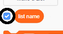

## یک لیست ایجاد کنید

+ Click on **Make a List** under **Variables**.

+ Type in the name of your list. You can choose whether you would like your list to be available to all sprites, or to only a specific sprite. Click **OK**.

+ هنگامی که لیست را ایجاد کردید، در طبقه نمایش داده می‌شود، یا می‌توانید با برداشتن علامت آن در برگه اسکریپت ها،آن را پنهان کنید.

+ در پایین لیست برای اضافه کردن موارد، بر روی `+` کلیک کنید و برای حذف یک مورد، بر روی ضربدر کنار آن کلیک کنید.

+ بلوک‌های جدید ظاهر می‌شود و به شما اجازه می‌دهد که از لیست جدید خود در پروژه‌ی خود استفاده کنید.

