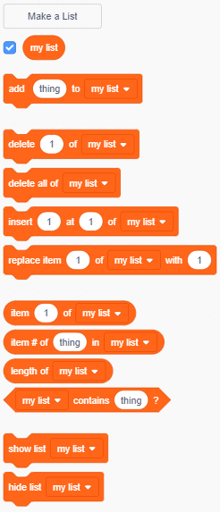

+ Mag-click sa **Gumawa ng Listahan** ilalim ng **variable**.

+ I-type ang pangalan ng iyong listahan. Maari kang pumili kung gusto mo maging available ang iyong list sa lahat ng sprites o para lamang sa isang espesipiko na sprite. I-click ang **OK**.

+ Kapag nagawa mo na yung listahan, makikita mo ito sa stage, o pwede mo alisin ang listahan sa Scripts tab upang itago ito.

+ I-click ang `+` sa ibaba ng list upang magdagdag ng mga items, at i-click ang krus sa tabi ng isang item upang tanggalin ito.

+ Ang mga bagong blocks na lalabas ay ginagamit upang ayusin ang bagong listahan sa iyong proyekto.

