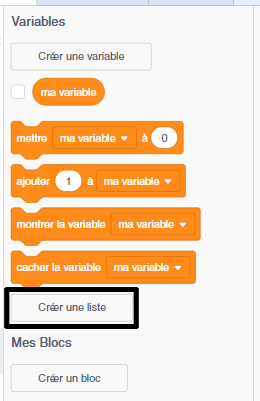
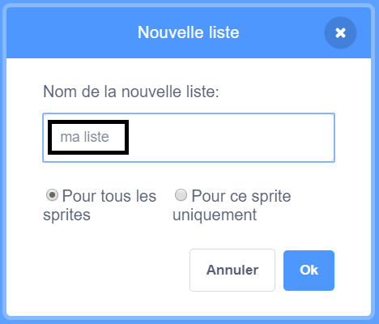
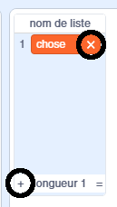
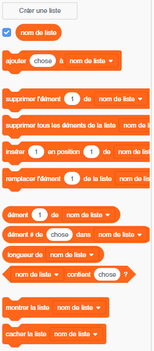

+ Click on **Make a List** under **Variables**.

+ Type in the name of your list. You can choose whether you would like your list to be available to all sprites, or to only a specific sprite. Click **OK**.

+ Une fois que tu as créé la liste, elle s'affiche sur la scène où tu peux la décocher dans l'onglet Scripts pour la masquer.

+ Clique sur le `+` en bas de la liste pour ajouter des éléments et clique sur la croix à côté d'un élément pour le supprimer.

+ De nouveaux blocs apparaîtront et te permettront d'utiliser ta nouvelle liste dans ton projet.

