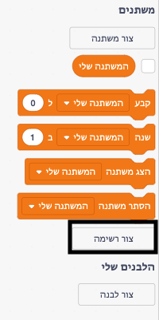
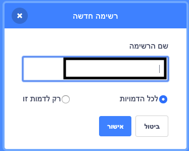
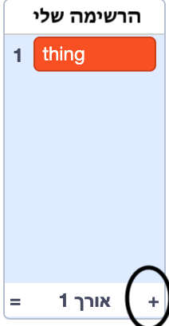
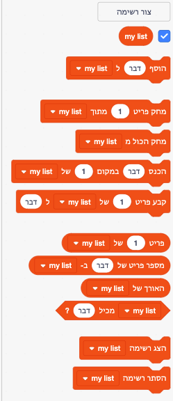

+ לחצו על **צור רשימה** תחת **משתנים**.

+ הקלידו את שם הרשימה שלכם. אתם יכולים לבחור אם הרשימה שלכם תהיה זמינה לכל הדמויות, או רק לדמות ספציפית. לחצו על **אישור**.

+ לאחר שיצרתם את הרשימה, היא תוצג על הבמה, אתם יכולים לבטל את הסימון של הרשימה בכרטיסיית הסקריפטים כדי להסתיר אותה.

+ לחצו על `+` בחלק התחתון של הרשימה כדי להוסיף פריטים, לחצו על ה-X ליד פריט כדי למחוק אותו.

+ בלוקים חדשים יופיעו ויאפשרו לכם להשתמש ברשימה החדשה בפרוייקט.

