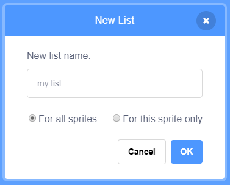

## सूची बनाएँ

+ Click on **Make a List** under **Variables**.

+ Type in the name of your list. You can choose whether you would like your list to be available to all sprites, or to only a specific sprite. Click **OK**.

+ सूची बन जाने पर, यह स्टेज पर दिखाई देगी, या आप इसे छिपाने के लिए स्क्रिप्ट(Scripts) टैब में टिक हटा(untick कर) सकते हैं।

+ चीज़ो(items) को शामिल करने के लिए सूची के नीचे `+` पर क्लिक करें, और किसी चीज़ को हटाने के लिए उसके आगे क्रॉस पर क्लिक करें।

+ नए ब्लॉक्स दिखाई देंगे और वे आपको आपके प्रोजेक्ट में आपकी नई सूची का उपयोग करने की सुविधा प्रदान करेंगे।

