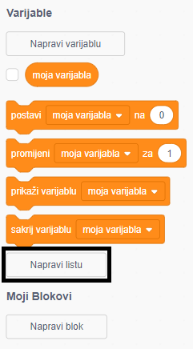
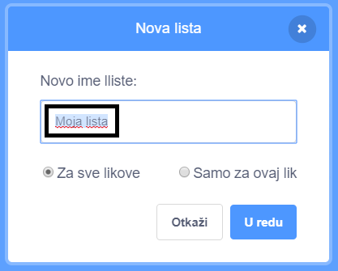
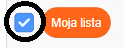
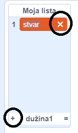
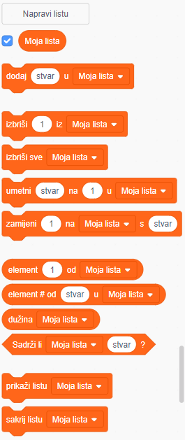

+ Click on **Make a List** under **Variables**.

+ Type in the name of your list. You can choose whether you would like your list to be available to all sprites, or to only a specific sprite. Click **OK**.

+ Nakon što napraviš listu, ona će se prikazati na Pozornici. Možeš maknuti kvačicu kraj liste na kartici Skripte da bi ju sakrio.

+ Klikni na znak `+` pri dnu popisa da bi dodao elemente liste. Klikni na križić pored elementa da bi ga izbrisao.

+ Prikazat će se novi blokovi i omogućiti ti da novu listu koristiš u projektu.

