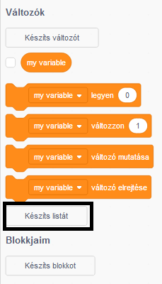
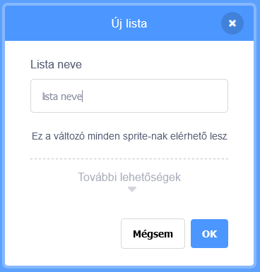
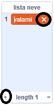
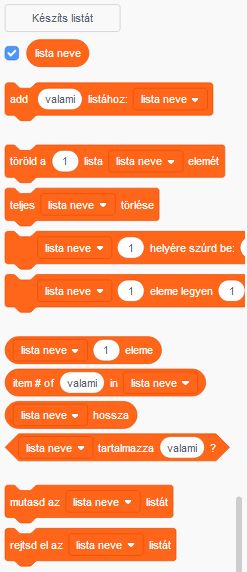

+ Click on **Make a List** under **Variables**.

+ Type in the name of your list. You can choose whether you would like your list to be available to all sprites, or to only a specific sprite. Click **OK**.

+ Miután létrehoztad a listát, megjelenik a játéktéren, de el is rejtheted a listát a Feladatok fülön a jelölőnégyzettel.

+ Új elemek hozzáadásához kattints a lista alján lévő `+` gombra. Törléshez kattints az elem melletti keresztre.

+ Új blokkok jelennek meg, amelyek lehetővé teszik az új lista felhasználását a projektedben.

