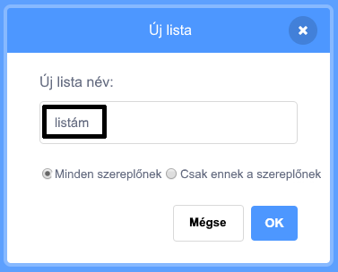

+ Kattints a **Készíts listát** gombra a **Változók** lapon.

+ Írd be a lista nevét. Kiválaszthatod, hogy a lista elérhető legyen minden szereplőnek, vagy csak egy adott szereplőnek. Nyomd meg az **OK** gombot.

+ Miután létrehoztad a listát, megjelenik a játéktéren, de el is rejtheted a listát a Feladatok fülön a jelölőnégyzettel.

+ Új elemek hozzáadásához kattints a lista alján lévő `+` gombra. Törléshez kattints az elem melletti keresztre.

+ Új blokkok jelennek meg, amelyek lehetővé teszik az új lista felhasználását a projektedben.

