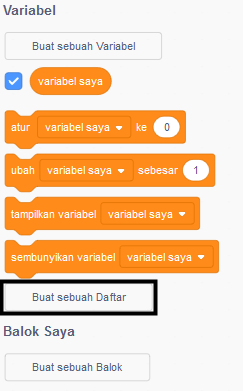
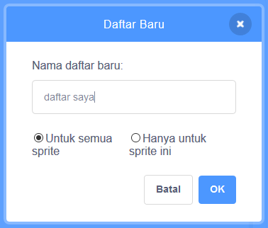
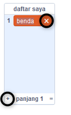
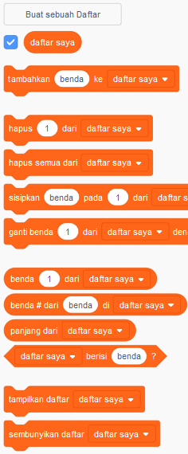

## Membuat sebuah daftar

+ Click on **Make a List** under **Variables**.

+ Type in the name of your list. You can choose whether you would like your list to be available to all sprites, or to only a specific sprite. Click **OK**.

+ Setelah Kamu membuat daftar, daftar tersebut akan ditampilkan pada Stage, atau Kamu bisa menghapus centang daftar di tab Scripts untuk menyembunyikannya.

+ Klik `+` di bagian bawah daftar untuk menambahkan item, dan klik tanda silang di sebelah item untuk menghapusnya.

+ Blok baru akan muncul dan memungkinkan Kamu untuk menggunakan daftar baru dalam proyek mu.

