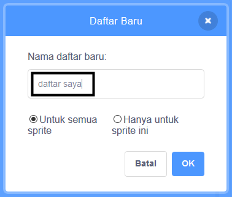

+ Klik pada **Buat Sebuah Daftar** di bagian **Variabel**.

+ Tuliskan nama daftar kamu. Silahkan kamu pilih, apakah daftar kamu bisa di akses di semua sprite atau hanya di sprite ini saja. Klik **OK**.

+ Setelah Kamu membuat daftar, daftar tersebut akan ditampilkan pada Stage, atau Kamu bisa menghapus centang daftar di tab Scripts untuk menyembunyikannya.

+ Klik `+` di bagian bawah daftar untuk menambahkan item, dan klik tanda silang di sebelah item untuk menghapusnya.

+ Blok baru akan muncul dan memungkinkan Kamu untuk menggunakan daftar baru dalam proyek mu.

