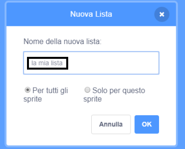

+ Fai clic su **Crea una lista** sotto **Variabili**.

+ Digita il nome della tua lista. Puoi scegliere se desideri che la tua variabile sia disponibile per tutti gli sprite o solo per lo sprite selezionato in quel momento. Premi **OK**.

+ Una volta creata la lista, questa verrà visualizzata sullo stage. Puoi nascondere la lista deselezionandola nella scheda Script.

+ Fai click su `+` in fondo all'elenco per aggiungere elementi alla tua lista, oppure fai clicca sulla x accanto a un elemento per eliminarlo.

+ Appariranno nuovi blocchi che ti permetteranno di usare la tua nuova lista nel tuo progetto.

