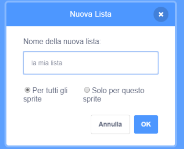

## Make a list

+ Click on **Make a List** under **Variables**.

+ Type in the name of your list. You can choose whether you would like your list to be available to all sprites, or to only a specific sprite. Click **OK**.

+ Una volta creata la lista, questa verrà visualizzata sullo stage. Puoi nascondere la lista deselezionandola nella scheda Script.

+ Click the `+` at the bottom of the list to add items, and click the cross next to an item to delete it.

+ Appariranno nuovi blocchi che ti permetteranno di usare la tua nuova lista nel tuo progetto.

