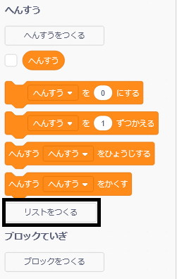
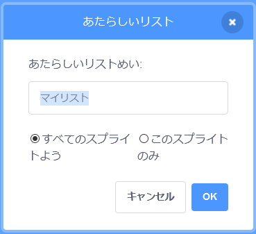
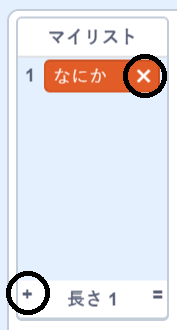
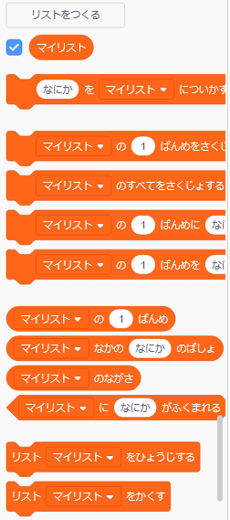

## リストを作る

+ Click on **Make a List** under **Variables**.

+ Type in the name of your list. You can choose whether you would like your list to be available to all sprites, or to only a specific sprite. Click **OK**.

+ 作ったリストはステージに表示されますが、「スクリプト」タブからリストの選択 (せんたく) を解除(かいじょ) してかくすことができます。

+ リストの一番下にある `+` をクリックして項目 (こうもく) を追加します。削除 (さくじょ) するには、項目の横にある×マークをクリックします。

+ 新しいブロックが表示され、新しいリストをプロジェクトで使用できるようになります。

