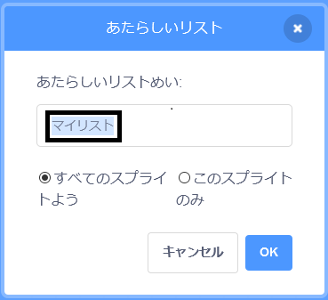

+ **へんすう**にある**リストをつくる**をクリックします。

+ リストの名前を入力しましょう。 リストをすべてのスプライトで使えるようにするか、または一つのスプライトのみで使えるようにするかをえらぶことができます。 **OK**をクリックします。

+ 作ったリストはステージに表示されますが、「へんすう」タブからリストのチェックを外してかくすこともできます。

+ リストの一番下にある `+` をクリックして項目 (こうもく) を追加します。削除 (さくじょ) するには、項目の横にある×マークをクリックします。

+ 新しいブロックが表示され、新しいリストをプロジェクトで使えるようになります。

