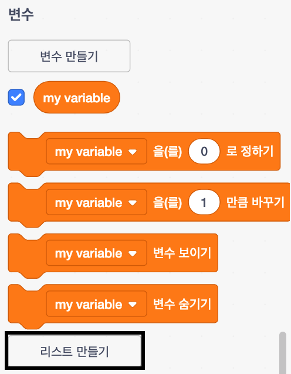
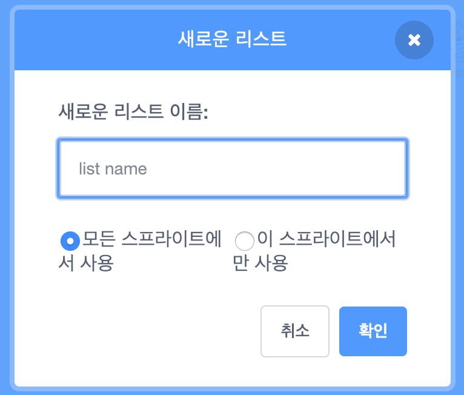
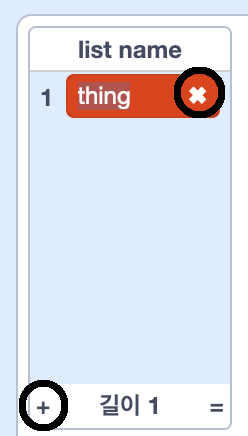
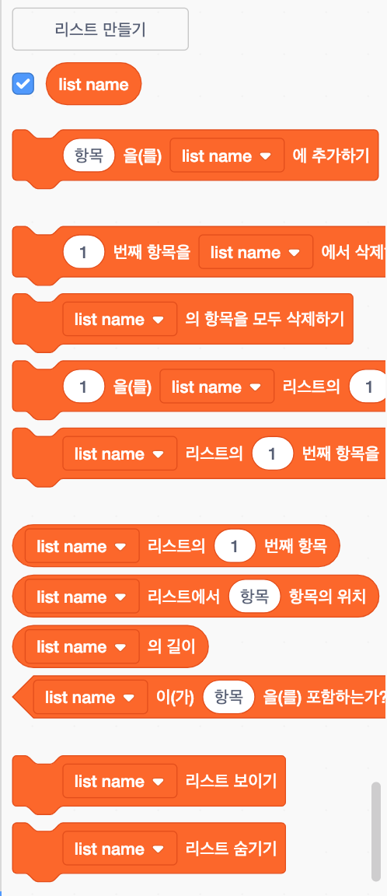

+ **변수** 항목 아래에 있는 **리스트 만들기** 를 클릭합니다.

+ 리스트의 이름을 입력하십시오. 리스트를 모든 스프라이트에 사용할 지 또는 이 스프라이트에만 사용할지 여부를 선택할 수 있습니다. **확인** 을 클릭하세요.

+ 리스트를 만든 후에는 무대에 리스트가 표시되고, 스크립트 탭에서 해당 리스트의 체크 표시를 해제하여 숨길 수 있습니다.

+ 리스트 하단에있는 `+` 를 클릭하여 항목을 추가하고, 항목 옆에있는 X 표시를 클릭하여 항목을 삭제 할 수 있습니다.

+ 새 블록이 나타날 것이며 프로젝트에서 새 리스트를 사용할 수 있습니다.

