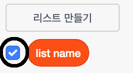

## 리스트 만들기

+ Click on **Make a List** under **Variables**.

+ Type in the name of your list. You can choose whether you would like your list to be available to all sprites, or to only a specific sprite. Click **OK**.

+ 리스트를 만든 후에는 무대에 리스트가 표시되고, 스크립트 탭에서 해당 리스트의 체크 표시를 해제하여 숨길 수 있습니다.

+ 리스트 하단에있는 `+` 를 클릭하여 항목을 추가하고, 항목 옆에있는 X 표시를 클릭하여 항목을 삭제 할 수 있습니다.

+ 새 블록이 나타날 것이며 프로젝트에서 새 리스트를 사용할 수 있습니다.

