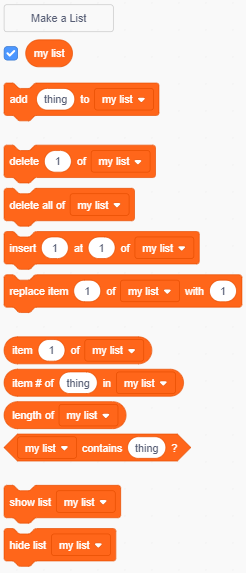

+ **Variables** अंतर्गत **Make a List** वर क्लिक करा.

+ आपल्या यादीच नाव टाइप करा. आपली यादी सर्व sprites साठी उपलब्ध असावी किंवा आपण केवळ एका विशिष्ट spriteसाठी निवडू शकता. **OK** वर क्लिक करा.

+ एकदा आपण सूची तयार केल्यावर ती स्टेजवर प्रदर्शित होईल किंवा ती लपविण्यासाठी आपण Scripts टॅबमध्ये यादी अनचेक करू शकता.

+ वस्तू जोडण्यासाठी सूचीच्या तळाशी असलेल्या `+` क्लिक करा आणि ते हटविण्यासाठी वस्तूच्या पुढील क्रॉसवर क्लिक करा.

+ नवीन ब्लॉक्स दिसून येतील आणि आपल्याला आपल्या प्रकल्पात आपली नवीन यादी वापरण्याची परवानगी देतील.

