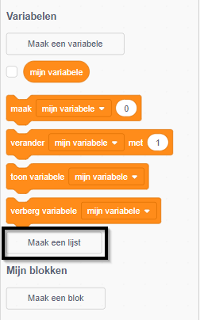
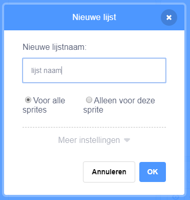
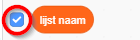
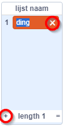
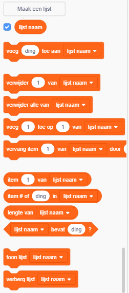

+ Klik op **Maak een lijst** onder **Variabelen**.

+ Typ de naam van je lijst in. Je kunt kiezen of je wilt dat je variabele beschikbaar is voor alle sprites of alleen voor deze sprite. Klik op **OK**.

+ Nadat je de lijst hebt gemaakt, wordt deze op het werkblad weergegeven. Je kunt ook de lijst op het tabblad Scripts afvinken om deze te verbergen.

+ Klik op `+` onder aan de lijst om items toe te voegen en klik op het kruisje naast een item om het te verwijderen.

+ Nieuwe blokken verschijnen en laten je de nieuwe lijst in je project gebruiken.

