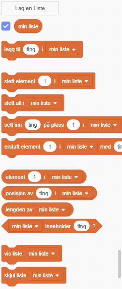

+ Klikk på **Lag en Liste** under **Variabler**.

+ Skriv inn navnet på listen din. Du kan velge om du vil at listen skal være tilgjengelig for alle figurer, eller bare en bestemt figur. Klikk **OK**.

+ Når du har opprettet listen vil den bli vist på scenen, eller du kan fjerne krysset ved listen på kode-arkfanen for å skjule den.

+ Klikk `+` nederst på listen for å legge til elementer, og klikk på krysset ved siden av et element for å slette det.

+ Nye klosser vil vises og lar deg bruke den nye listen i prosjektet ditt.

