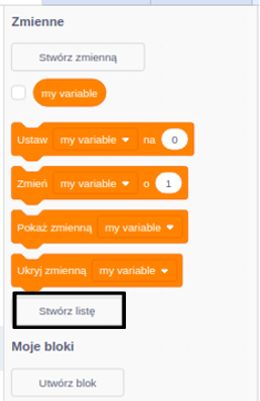
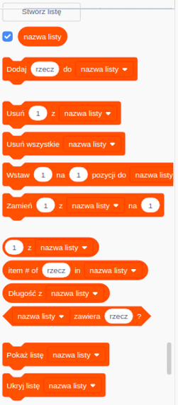

## Utwórz listę

+ Click on **Make a List** under **Variables**.

+ Type in the name of your list. You can choose whether you would like your list to be available to all sprites, or to only a specific sprite. Click **OK**.

+ Po utworzeniu zmiennej zostanie ona wyświetlona na scenie. Możesz też odznaczać ją na karcie Skrypty, aby ją ukryć.

+ Kliknij `+` na dole listy, aby dodać elementy, kliknij krzyżyk obok elementu, aby go usunąć.

+ Pojawią się nowe bloki i będziesz mógł użyć nowej listy w projekcie.

