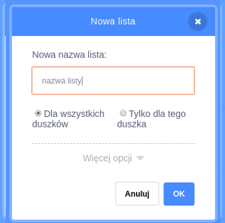
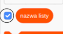
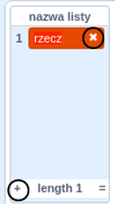

+ Kliknij **Stwórz listę** poniżej **Zmienne**.

+ Wpisz nazwę swojej listy. Możesz wybrać, czy chcesz, aby twoja lista była dostępna dla wszystkich duszków, czy tylko dla tego duszka. Kliknij **OK**.

+ Po utworzeniu listy zostanie ona wyświetlona na planszy. Możesz też odznaczać ją na karcie Skrypty, aby ją ukryć.

+ Kliknij `+` na dole listy, aby dodać elementy, kliknij krzyżyk obok elementu, aby go usunąć.

+ Pojawią się nowe bloki i będziesz mógł użyć nowej listy w projekcie.

