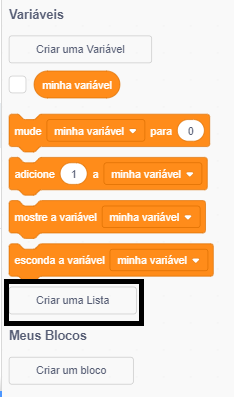
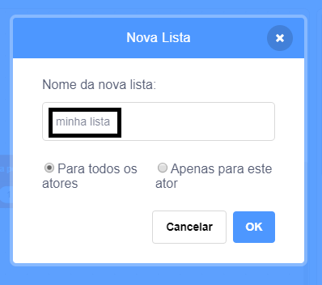
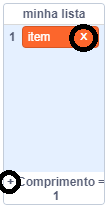
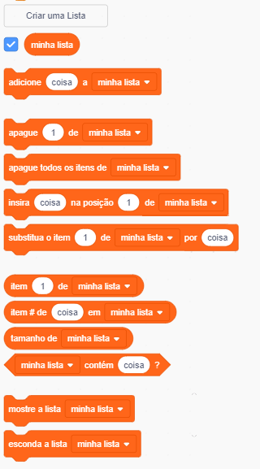

+ Clique em **Faça uma Lista** abaixo de **Variáveis**.

+ Digite o nome da sua lista. Você pode escolher se deseja que sua lista esteja disponível para todos os atores, ou apenas para um ator específico. Clique **OK**.

+ Depois de criar a lista, ela será exibida no palco, você também pode desmarca-la na aba Scripts para ocultá-la.

+ Clique no `+` na parte inferior da lista para adicionar itens e clique no x ao lado de um item para excluí-lo.

+ Novos blocos aparecerão e permitirão que você use sua nova lista no seu projeto.

