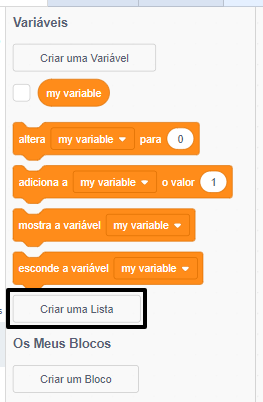
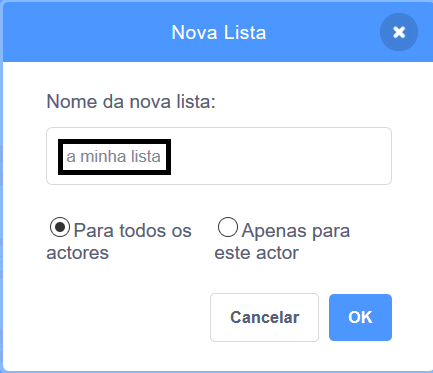
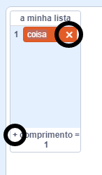

+ Clica em **Criar uma Lista** na categoria **Variáveis**.

+ Escreve o nome da sua lista. Podes escolher se desejas que a tua lista esteja disponível para todos os atores, ou apenas para um ator específico. Clica **OK**.

+ Depois de criares a lista ela será exibida no palco, ou podes desmarcá-la na lista no separador Código para ocultá-la.

+ Clica em `+` na parte inferior da lista para adicionar itens e clica na cruz ao lado de um item para o remover.

+ Aparecerão novos blocos e permitirão que uses a tua nova lista no teu projeto.

