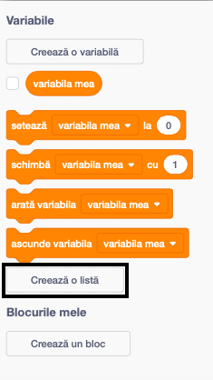
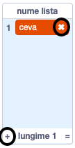
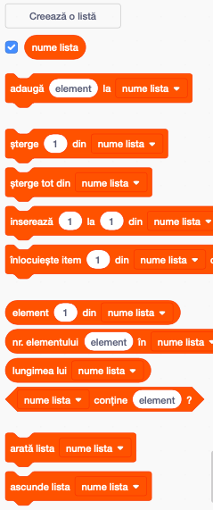

+ Apasă pe **Creează o listă** sub **Variabile**.

+ Dă un nume listei tale. Poți alege ca lista ta să fie disponibilă pentru toate personajele sau doar pentru un anumit personaj. Apasă **OK**.

+ Odată ce ai creat lista, aceasta va fi afișată pe scenă, sau poți debifa lista în tabul Cod, pentru a o ascunde.

+ Dă click pe `+` în partea de jos a listei pentru a adăuga elemente și dă click pe cruciulița de lângă un element pentru a-l șterge.

+ Se vor afișa noi blocuri care îți vor permite să folosești lista ta nouă în proiect.

