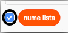

## Creați o listă

+ Click on **Make a List** under **Variables**.

+ Type in the name of your list. You can choose whether you would like your list to be available to all sprites, or to only a specific sprite. Click **OK**.

+ Odată ce ați creat lista, aceasta va fi afișată pe scenă, sau puteți debifa lista din fila Scripturi pentru a o ascunde.

+ Faceți clic pe `+`, în partea de jos a listei, pentru a adăuga elemente și faceți clic pe cruciulița de lângă un element pentru a-l șterge.

+ Se vor afișa noi blocuri care vă vor permite să utilizați noua dvs. listă în proiect.

