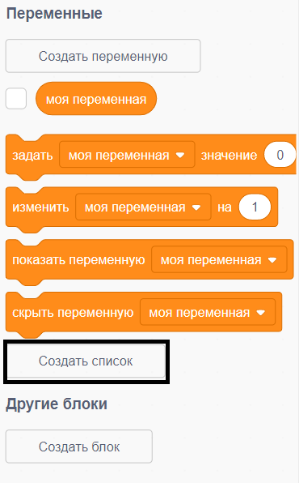
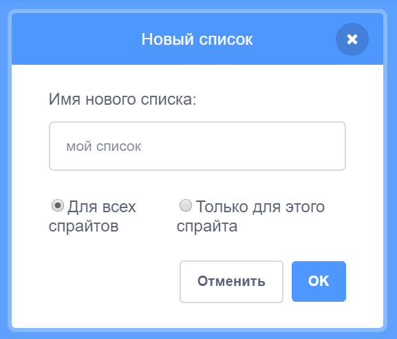
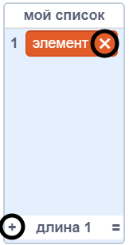
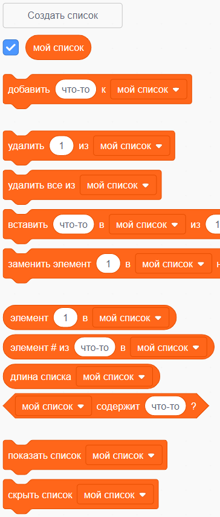

+ Click on **Make a List** under **Variables**.

+ Type in the name of your list. You can choose whether you would like your list to be available to all sprites, or to only a specific sprite. Click **OK**.

+ После того, как тобой был создан этот самый список, ты можешь указать: хочешь ли ты, чтобы он отображался на сцене. Сделать это можно на вкладке «Скрипты».

+ Нажми кнопку `+` в нижней части списка, чтобы добавить элементы. Удалить элемент списка можно щелкнув по кнопке-крестике, которая находится в его правой части.

+ Появятся новые блоки и ты сможешь использовать свой новый список в своем проекте.

