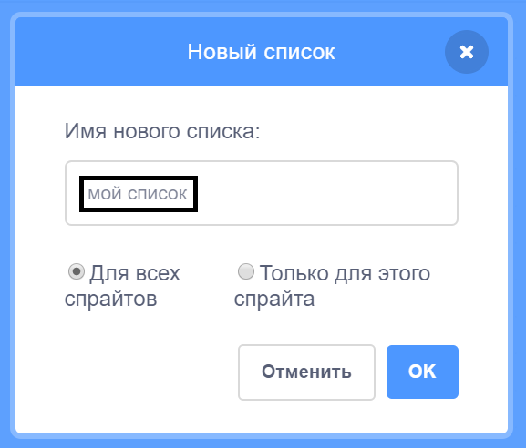

+ Нажмите **Создать список** во вкладке **Переменные**.

+ Введи имя своего списка. Ты можешь выбрать, хочешь ли ты, чтобы твой лист был во всех спрайтах или только в этом спрайте. Нажми **OK**.

+ После того, как ты создал этот список, ты можешь указать: хочешь ли ты, чтобы он отображался на сцене. Это можно сделать на вкладке «Скрипты».

+ Нажми кнопку `+` в нижней части списка, чтобы добавить элементы в список. Удалить элемент можно, если нажать на крестик, который находится справа от него.

+ Появятся новые блоки, и ты сможешь использовать свой новый список в своем проекте.

