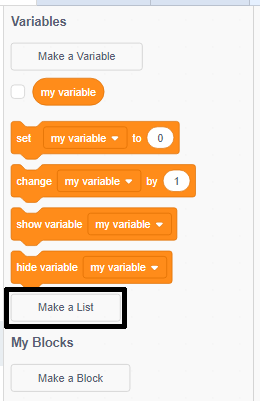

+ **විචල්යයන්(Variables)** යටතේ ඇති **ලැයිස්තුවක් සාදන්න(Make a List)** මත ක්ලික් කරන්න.

+ ඔබගේ ලැයිස්තුවේ නම ටයිප් කරන්න. ඔබේ ලැයිස්තුව සියලු sprite වලට ලබා ගැනීමට හැකිද යන්න ඔබට තේරිය හැක, හෝ නිශ්චිත sprite එකකට පමණක් ලබා ගැනීමට හැකිද යන්න ඔබට තෝරා ගත හැකිය. **හරි(OK)** ක්ලික් කරන්න.

+ ඔබ ලැයිස්තුව නිර්මාණය කළ පසු, එය වේදිකාවේ දර්ශනය වනු ඇත, නැතහොත් ඔබට එය සැඟවීමට අවශ්‍ය නම් ස්ක්‍රිප්ට් පටිත්තේ(Script tab) අති ලයිස්තුව අන්ටික් කරන්න.

+ අයිතම එකතු කිරීමට ලැයිස්තුවේ පතුලේ ඇති `+` ක්ලික් කරන්න, එය මකා දැමීමට අයිතමයක් අසල ඇති කතිරය ක්ලික් කරන්න.

+ නව කට්ටල(New blocks) දර්ශනය වනු ඇත, ඔබගේ ව්‍යාපෘතියේ ඔබගේ නව ලැයිස්තුව භාවිතා කිරීමට දැන් හැකිය.

