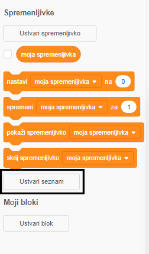
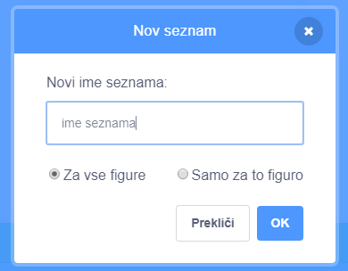
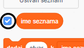
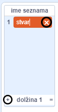
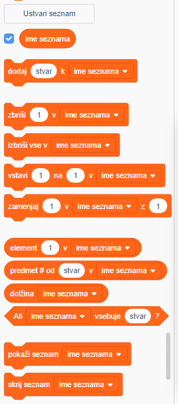

+ Klikni na **Ustvari seznam** pod **Spremenljivke**.

+ Vnesi ime svojega seznama. Izbereš lahko ali naj bo tvoj seznam na voljo vsem figuram ali zgolj točno določeni figuri. Pritisni **OK**.

+ Ko ustvariš seznam, se bo ta prikazal na odru, lahko pa ga tudi skriješ, tako da seznam odznačiš v zavihku Koda.

+ Klikni na `+` na dnu seznama, če želiš dodati elemente ali klikni na križec poleg elementa, če ga želiš izbrisati.

+ Pojavili se bodo novi bloki, ki omogočajo uporabo novega seznama v projektu.

