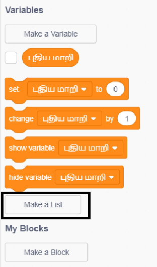
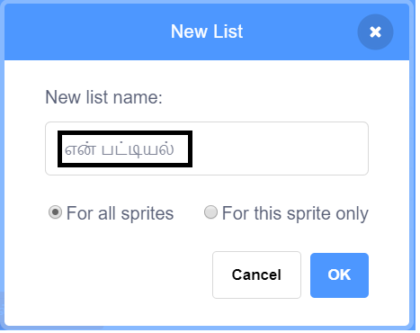
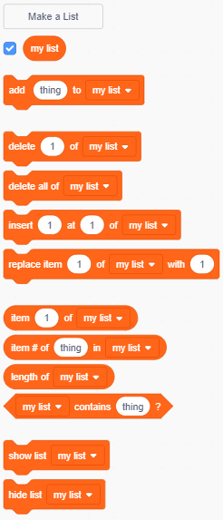

+ **மாறிகளின்(Variables)** கீழே உள்ள **ஒரு பட்டியலை உருவாக்கு(Make a List)** என்பதைக் கிளிக் செய்க.

+ உங்கள் பட்டியலின் பெயரைத் தட்டச்சு செய்க. உங்கள் பட்டியல் அனைத்து ஸ்ப்ரைட்டிற்கும்(sprite) பொருந்துமா அல்லது ஒரு குறிப்பிட்ட ஸ்ப்ரைட்டிற்கு மட்டுமே பொருந்த வேண்டுமென விரும்புகிறீர்களா என்பதை நீங்கள் தேர்வு செய்யலாம். **OK** -ஐக் கிளிக் செய்யவும்.

+ பட்டியலை உருவாக்கியவுடன், அது மேடையில் காண்பிக்கப்படும் அல்லது அதை மறைக்க ஸ்கிரிப்டுகள் தாவலில் பட்டியலை நீக்கலாம்.

+ உருப்படிகளை சேர்ப்பதற்கு பட்டியலின் அடிப்பகுதியில் உள்ள `+` -ஐக் கிளிக் செய்யவும், ஏதேனும் ஒரு உருப்படியை நீக்க, அதற்கு அருகில் உள்ள குறுக்கு(x) குறியீட்டைக் கிளிக் செய்யவும்.

+ புதிய தொகுதிகள் தோன்றும் மற்றும் உங்கள் புதிய பட்டியலை உங்கள் திட்டத்தில் பயன்படுத்த அனுமதிக்கும்.

