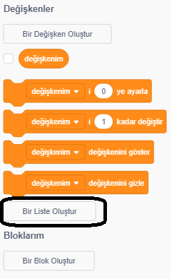
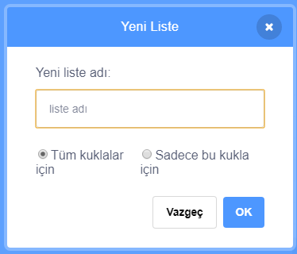
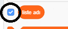
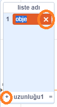
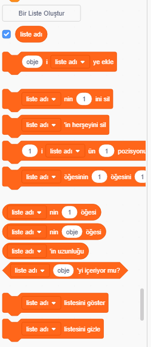

+ **Değişkenler** 'in altındaki **Bir Liste Oluştur** 'a tıklayın.

+ Listeniz için bir isim yazın. Listenizin tüm Kuklalar için mi yoksa yalnızca belirli bir Kukla için geçerli olmasını, isteyip istemediğinizi seçebilirsiniz. **TAMAM** 'ı tıklayın.

+ Listeyi oluşturduktan sonra, sahnede görüntülenir. Gizlemek için Diziler sekmesinde listenin yanındaki işareti kaldırabilirsiniz.

+ Öğe eklemek için listenin en altındaki `+` işaretine tıklayın. Silmek için ise bir öğenin yanındaki çarpı işaretine tıklayın.

+ Yeni bloklar ortaya çıkacak ve yeni listeniz projenizde kullanılabilecektir.

