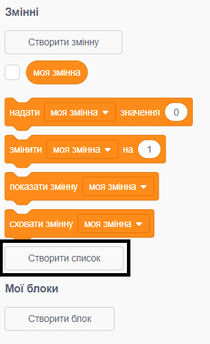
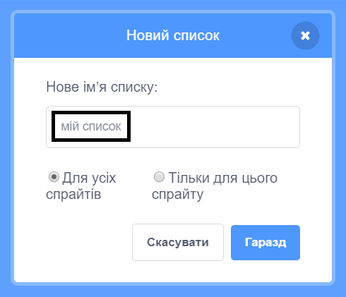
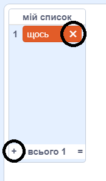
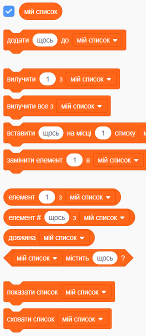

+ Натисніть **Створити список** у розділі **Змінні**.

+ Введіть назву свого списку. Ви можете вибрати, щоб ваш список може бути доступним для всіх спрайтів або тільки для цього конкретного спрайту. Натисніть **Гаразд**.

+ Після того як ви створили список, він буде відображатися на сцені, або ви можете зняти галочку з нього у меню блоків, щоб сховати його.

+ Натисніть `+` в нижній частині списку, щоб додати елементи, або натисніть хрестик поруч із елементом, щоб видалити його.

+ З'являться нові блоки, які дозволять використовувати ваш новий список у вашому проекті.

